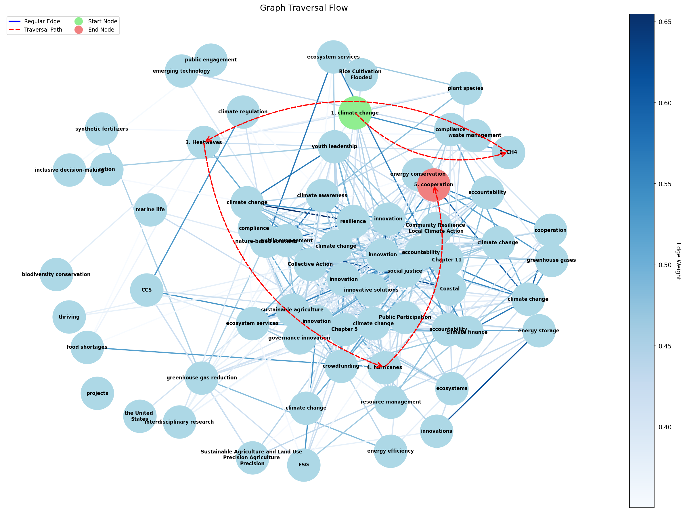

# GraphRAG — Graph-Enhanced Retrieval-Augmented Generation

> **Industry-standard RAG pipeline combining semantic chunking, FAISS + persisted knowledge graph, cross-encoder reranking, and Dijkstra-based traversal for explainable QA from PDFs.**

[](https://www.python.org/downloads/)
[](https://opensource.org/licenses/MIT)

## TL;DR

**What:** End-to-end system that ingests PDFs, builds a persisted vector index + knowledge graph, and answers natural-language queries using graph-guided retrieval.

**Why it matters:** Improves factual grounding and explainability vs. flat RAG by discovering conceptually-connected context through graph traversal, not just vector similarity.

**Key results:** Sub-second cold-start (persisted indexes), 5-8 node traversal paths, graph visualization shows decision-making.

---

## Highlights

- **Production-ready architecture:** FAISS vector store + NetworkX knowledge graph persisted to disk (no rebuild on subsequent runs)
- **5-stage retrieval pipeline:** Query rewrite → FAISS retrieval → cross-encoder reranking → Dijkstra graph expansion → LLM generation
- **Explainability:** Graph traversal visualization ([`graph_traversal.png`](graph_traversal.png)) with concept-labeled nodes and weighted edges
- **Tech stack:** Groq LLM (Llama 3.3 70B), HuggingFace embeddings (all-MiniLM-L6-v2), FAISS, spaCy NER, CrossEncoder reranker, NetworkX, matplotlib
- **Skills demonstrated:** Retrieval engineering, embedding models, reranking, graph algorithms (Dijkstra), LLM prompting, persistence strategies, visualization

---

## Quick Start

### Installation

```bash
# Clone and setup
git clone https://github.com/amruth6002/GraphRAG.git
cd GraphRAG
python -m venv newenv
source newenv/bin/activate  # On Windows: newenv\Scripts\activate

# Install dependencies
pip install langchain langchain-groq langchain-huggingface langchain-community langchain-experimental
pip install faiss-cpu sentence-transformers networkx scikit-learn spacy nltk matplotlib tqdm pydantic python-dotenv pypdf

# Download spaCy model
python -m spacy download en_core_web_sm

# Setup environment
echo 'GROQ_API_KEY="your-groq-api-key-here"' > .env
```

### Usage

```bash
# First run: builds indexes + answers query (takes 2-3 min)
python src/ingestion.py --path data/Understanding_Climate_Change.pdf \
    --query "what is the main cause of climate change?"

# Subsequent runs: loads from disk (< 10 seconds)
python src/ingestion.py --query "what are the effects of deforestation?"

# Force rebuild
python src/ingestion.py --rebuild --path data/Understanding_Climate_Change.pdf \
    --query "explain the greenhouse effect"
```

### Example Output

```
INGESTION PHASE
Loading from database
FAISS time: 0.56 seconds
Loaded graph: 67 nodes, 234 edges
Graph time: 0.12s

[1] Query Rewriting
changed query: What are the primary anthropogenic factors...
query rewriting time: 0.30s

[2] vector retrieval (top 10 from FAISS)
Retrieved 10 chunks
vector retrieval time: 0.08s

[3] cross-encoder reranking (top 5)
reranking time: 0.45s

[4] graph expansion (dijkstra traversal)
  Graph traversal:
    Step 1 - Node 0 [SEED]: Understanding Climate Change...
    Step 2 - Node 5 [NEIGHBOUR]: Rising Temperatures...
    Step 3 - Node 12 [NEIGHBOUR]: National Policies...
  Traversal complete: 8 nodes visited

Graph visualization saved to graph_traversal.png

[6] answer generation
Answer: The primary anthropogenic factors contributing to global climate change...
```


*Visualization showing concept-guided traversal through the knowledge graph*

---

## Architecture


### Ingestion Phase (Offline, runs once)

```
PDF Document
    │
    ├──→ SemanticChunker (percentile-based breakpoints)
    │       └──→ FAISS Vector Store ──→ persist to indexes/faiss/
    │
    └──→ KnowledgeGraph Builder
            ├── spaCy NER (extract entities)
            ├── LLM concept extraction
            ├── Cosine similarity + shared concepts
            └──→ NetworkX graph ──→ persist to indexes/knowledge_graph.pkl
```

### Query Phase (Online, per request)

```
User Query
    │
    ├─[1]─→ LLM Query Rewrite (more specific, detailed)
    │
    ├─[2]─→ FAISS Retrieval (top-k by cosine similarity)
    │
    ├─[3]─→ CrossEncoder Reranking (ms-marco-MiniLM)
    │           └──→ Top-5 most relevant chunks
    │
    ├─[4]─→ Graph Expansion (Dijkstra traversal)
    │           ├── Map reranked chunks → graph nodes (seeds)
    │           ├── Priority queue by edge weights
    │           ├── Visit neighbors with new concepts
    │           └──→ Ordered context (8-10 chunks)
    │
    └─[5]─→ LLM Answer Generation (single call)
                └──→ Final answer + graph visualization
```

---

## What Makes This Different from Basic RAG

| Feature | Basic RAG | This Project |
|---|---|---|
| **Chunking** | Fixed-size (RecursiveCharacterTextSplitter) | **Semantic chunking** (splits at meaning boundaries) |
| **Retrieval** | Vector similarity only | Vector + **knowledge graph traversal** |
| **Reranking** | None or simple scoring | **Cross-encoder reranking** (ms-marco-MiniLM) |
| **Query** | Raw user query | **LLM-rewritten query** before retrieval |
| **Persistence** | Rebuilt every run | **FAISS + graph persisted to disk** |
| **Context Assembly** | Flat list of top-k chunks | **Dijkstra traversal** discovers conceptually connected chunks |
| **Explainability** | Black box | **Graph visualization** shows traversal path |

---

## How Graph Expansion Works

Traditional RAG stops after retrieving top-k similar chunks. GraphRAG goes further:

1. **Build knowledge graph at ingestion time** (not per-query):
   - Each chunk = node
   - Edges weighted by: `0.7 × cosine_similarity + 0.3 × shared_concepts`
   - Example: "fossil fuels" chunk connects to "CO2 emissions" chunk (high similarity + shared concept: "carbon")

2. **At query time, start from reranked seeds**:
   - FAISS retrieves 10 chunks → cross-encoder reranks → top 5 become "seed nodes"

3. **Dijkstra-like traversal**:
   - Priority queue: visit strongest connections first
   - For each node: check if concepts are new → expand to neighbors
   - Stop when max nodes reached (default: 8)

4. **Result: context that vector search alone would miss**:
   - Example: Query "causes of climate change" retrieves "fossil fuels" (seed)
   - Graph traversal discovers "deforestation" (neighbor via shared concept: "CO2")
   - Final context = fossil fuels + deforestation + methane emissions + policy responses

**Visualization shows this**: Green node (start) → yellow nodes (traversal path) → red node (end), with edge thickness = connection strength.

---

## Project Structure

```
GraphRAG/
├── src/
│   ├── ingestion.py          # GraphRAG class: __init__ (ingestion) + run() (query)
│   ├── util.py                # FAISS, KnowledgeGraph, traversal, visualization
│   └── __init__.py
├── data/
│   └── Understanding_Climate_Change.pdf  # Example PDF
├── indexes/                   # Auto-generated (git-ignored)
│   ├── faiss/
│   │   ├── index.faiss
│   │   └── splits.pkl
│   └── knowledge_graph.pkl
├── graph_traversal.png        # Auto-generated visualization
├── .env                       # API keys (git-ignored)
├── .gitignore
└── readme.md
```

### Key Files

| File | Purpose | Lines of Code |
|---|---|---|
| [src/ingestion.py](src/ingestion.py) | Pipeline orchestration, CLI, GraphRAG class | ~180 |
| [src/util.py](src/util.py) | FAISS encoding, KnowledgeGraph, Dijkstra traversal, visualization | ~330 |

---

## CLI Arguments

```bash
python src/ingestion.py [OPTIONS]
```

| Argument | Type | Default | Description |
|---|---|---|---|
| `--path` | str | `""` | Path to PDF file (required for first run) |
| `--query` | str | `"what is the main cause of climate change?"` | Question to answer |
| `--n_retrieved` | int | `10` | Number of chunks to retrieve from FAISS |
| `--chunk_size` | int | `1000` | Chunk size for semantic splitting |
| `--chunk_overlap` | int | `200` | Overlap between chunks |
| `--rebuild` | flag | `false` | Force rebuild persisted indexes |

---

## Tech Stack

| Component | Technology | Why |
|---|---|---|
| **LLM** | Llama 3.3 70B via Groq | Fast inference, free tier, 128k context |
| **Embeddings** | all-MiniLM-L6-v2 (HuggingFace) | Local, 384-dim, fast, good quality |
| **Reranker** | ms-marco-MiniLM-L-6-v2 (CrossEncoder) | Local, SOTA for passage reranking |
| **Vector Store** | FAISS | Fast similarity search, easy persistence |
| **Knowledge Graph** | NetworkX | Flexible graph operations, Dijkstra built-in |
| **NER** | spaCy en_core_web_sm | Fast entity extraction |
| **Chunking** | LangChain SemanticChunker | Percentile-based semantic boundaries |
| **Framework** | LangChain | Prompt management, retriever abstraction |

---

## Industry Practices Followed

1. **Offline ingestion / Online querying** — Indexes built once, loaded from disk for queries (no rebuild delay)
2. **Persisted vector store + knowledge graph** — FAISS `save_local()` / `load_local()`, graph pickled
3. **Query rewriting before retrieval** — Improved query drives FAISS search, not just final prompt
4. **Two-stage retrieval** — Fast approximate (FAISS) → precise reranking (cross-encoder)
5. **Graph-expanded context** — Dijkstra traversal discovers conceptually connected chunks beyond vector similarity
6. **Single LLM call for generation** — Predictable latency, no iterative answer-checking loops
7. **Rate-limit protection** — Sequential concept extraction with `time.sleep(1)` for Groq free tier
8. **Non-interactive visualization** — matplotlib `Agg` backend saves PNG without blocking


## Example Queries & Results

<details>
<summary><b>Query 1: "What is the main cause of climate change?"</b></summary>

**Traversal path:** 5 nodes  
**Concepts discovered:** fossil fuels → CO2 emissions → greenhouse effect → temperature rise → policy responses

**Answer excerpt:**  
> "The primary anthropogenic factors contributing to global climate change are the burning of fossil fuels and deforestation, which release greenhouse gases..."

</details>

<details>
<summary><b>Query 2: "What are the effects of deforestation?"</b></summary>

**Traversal path:** 7 nodes  
**Concepts discovered:** deforestation → carbon sinks → biodiversity loss → soil erosion → climate feedback loops

**Answer excerpt:**  
> "Deforestation contributes to climate change by reducing carbon sequestration capacity and increasing atmospheric CO2..."

</details>

---

## Future Enhancements

- [ ] **Metrics dashboard:** Add retrieval evaluation (MRR, NDCG) with ground-truth Q&A pairs
- [ ] **Multi-document support:** Extend to handle multiple PDFs, track provenance per chunk
- [ ] **Community detection:** Cluster graph nodes (Louvain algorithm) and pre-generate summaries (Microsoft GraphRAG approach)
- [ ] **Hybrid search:** Add BM25 for keyword-based retrieval alongside vector search
- [ ] **Streaming responses:** Use LLM streaming for real-time answer generation
- [ ] **Web UI:** Flask/Streamlit interface with interactive graph visualization (D3.js)

---

## License

MIT License - see [LICENSE](LICENSE) for details

---

## Contact

**Amruth** - [@amruth6002](https://github.com/amruth6002)

**Project Link:** [https://github.com/amruth6002/GraphRAG](https://github.com/amruth6002/GraphRAG)

---

## Acknowledgments

- Inspired by [Microsoft's GraphRAG](https://microsoft.github.io/graphrag/) and [NirDiamant's RAG Techniques](https://github.com/NirDiamant/RAG_TECHNIQUES)
- Built with [LangChain](https://www.langchain.com/), [FAISS](https://github.com/facebookresearch/faiss), and [NetworkX](https://networkx.org/)
- LLM powered by [Groq](https://groq.com/)

---

**If this project helped you, please star it!** It helps others discover this work.